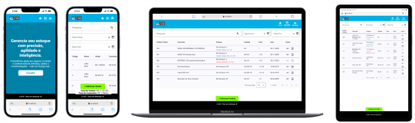

# ⚡ Projeto Gerenciamento de Estoque

## 🚀 Bem-vindo ao projeto de gerenciamento de Estoque StockFlow!

### Este é um projeto desenvolvido em Angular.

## Pré-requisitos

Antes de começar, certifique-se de ter o **Node.js** e o **npm** instalados em seu ambiente de desenvolvimento.

- **Node.js**: [Baixar Node.js](https://nodejs.org/)
- **npm** (gerenciador de pacotes do Node.js): Geralmente instalado junto com o Node.js

## Funcionalidades

- **Consulta e Movimentação de Estoque**: Permite listar, lançar e estornar movimentações de entrada e saída de mercadorias.
- **Filtros de Pesquisa**: Possibilita consultar movimentações por produto, data ou tipo.
- **Cálculo de Comissões**: Calcula automaticamente a comissão de cada vendedor seguindo as regras:
  - Vendas abaixo de R$100,00 → 0%
  - Vendas entre R$100,00 e R$499,99 → 1%
  - Vendas a partir de R$500,00 → 5%
- **Ranking de Vendas e Comissões**: Exibe os vendedores ranqueados pelo total de vendas e comissão.
- **SPA (Single Page Application)**: Aplicação com navegação sem recarregamento de página, utilizando Angular Router para gerenciamento de rotas.
- **Componentização**: Estrutura modular e reutilizável de componentes, permitindo escalabilidade e manutenção facilitada.
- **Responsividade**: O projeto é otimizado para diferentes tamanhos de tela, com a interface adaptável para dispositivos móveis, tablets e desktops.
- **Gerenciamento de Estado**: Utiliza o **LocalStorage** para persistir dados no navegador, permitindo que as movimentações de estoque e comissões sejam salvas entre as sessões do usuário.
- **Acessibilidade e Semântica**: A aplicação segue boas práticas de acessibilidade, utilizando tags semânticas adequadas (como `<header>`, `<footer>`, `<section>`, etc.) e garantindo que a navegação seja possível com teclado e leitores de tela.
- **Angular Material**: para interface, a aplicação proporciona uma experiência de usuário moderna.

## Instalação

1. Instale as dependências necessárias do projeto utilizando npm:

   ```bash
   npm install

   ```

2. Para iniciar o servidor de desenvolvimento do Angular e visualizar o projeto:

   ```bash
   ng serve --open
   ```



**Divirta-se, navegue e explore essa experiência! 🚀**
